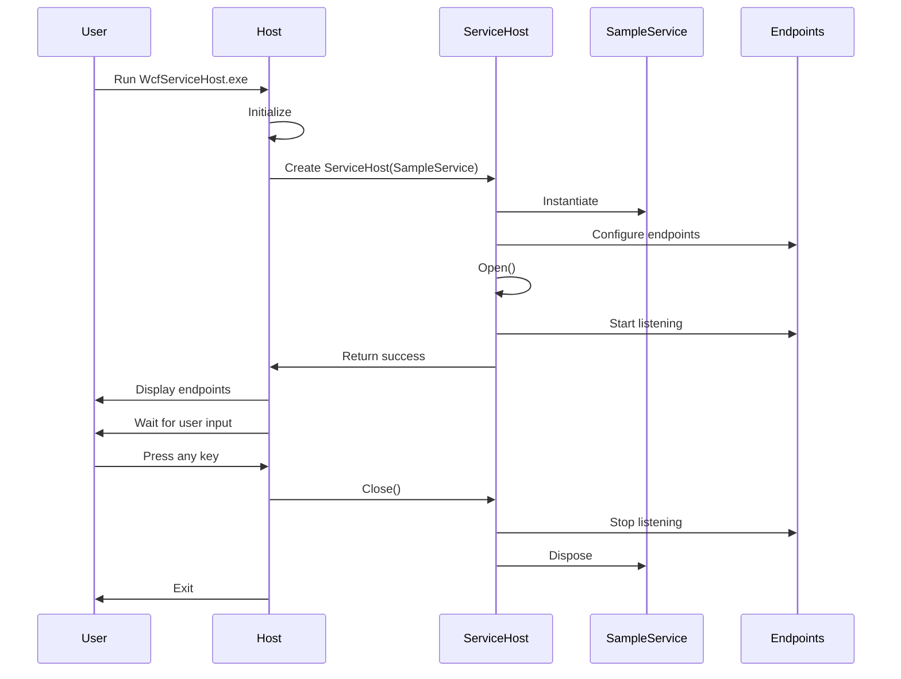
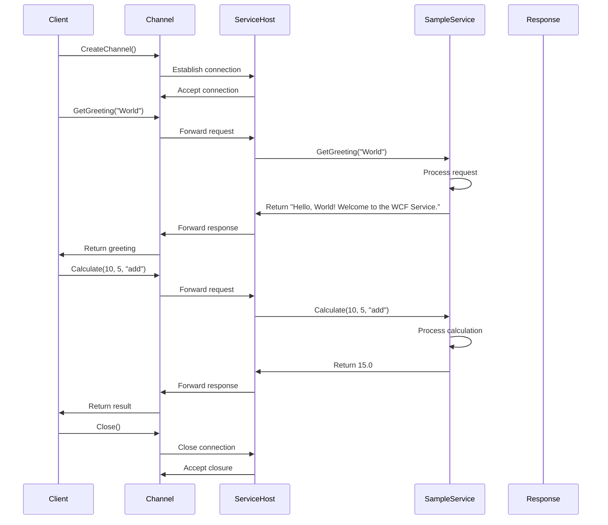
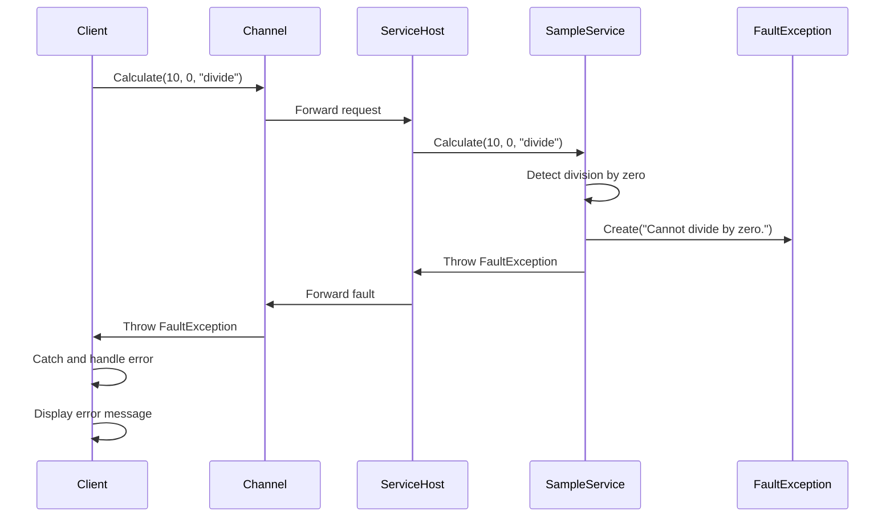

# WCF Service Project - Comprehensive Documentation

## Table of Contents
1. [Project Overview](#project-overview)
2. [Architecture Overview](#architecture-overview)
3. [Interface Specifications](#interface-specifications)
4. [File Responsibilities](#file-responsibilities)
5. [Component Diagram](#component-diagram)
6. [Sequence Diagrams](#sequence-diagrams)
7. [Functional Flow](#functional-flow)
8. [Configuration Details](#configuration-details)
9. [Build and Deployment](#build-and-deployment)
10. [Testing and Validation](#testing-and-validation)

## Project Overview

### Purpose
This is a production-ready Windows Communication Foundation (WCF) service application built with .NET Framework 4.0. The service provides basic operations including greetings, calculations, server time retrieval, and message echoing.

### Technology Stack
- **Framework**: .NET Framework 4.0
- **Communication**: WCF (Windows Communication Foundation)
- **Binding**: Basic HTTP Binding
- **Hosting**: Self-hosted console application
- **Client**: Console-based test client

### Project Structure
```
dotnet-monolith-v3/
├── WcfService.sln                 # Main solution file
├── WcfServiceLibrary/            # Core service library
├── WcfServiceHost/               # Service hosting application
├── WcfServiceClient/             # Test client application
├── build.bat                     # Windows batch build script
├── build.ps1                     # PowerShell build script
└── Documentation files
```

## Architecture Overview

### Architecture Pattern
- **Service-Oriented Architecture (SOA)**
- **Client-Server Pattern**
- **Self-Hosting Pattern**

### Key Components
1. **Service Contract** - Defines the service interface
2. **Service Implementation** - Business logic implementation
3. **Service Host** - Runtime environment for the service
4. **Service Client** - Test client for service validation
5. **Configuration** - Service and client configuration files

### Communication Flow
```
[Client] ←→ [WCF Service] ←→ [Business Logic]
   ↑              ↑                ↑
HTTP Request   WCF Runtime    Service Methods
```

## Interface Specifications

### ISampleService Contract

#### Service Contract Attributes
- **Namespace**: `WcfServiceLibrary`
- **Service Contract**: `[ServiceContract]`
- **Binding**: Basic HTTP Binding
- **Transport**: HTTP
- **Port**: 8733

#### Operation Contracts

##### 1. GetGreeting Operation
```csharp
[OperationContract]
string GetGreeting(string name);
```
- **Purpose**: Returns a personalized greeting message
- **Input**: `name` (string) - The name to greet
- **Output**: `string` - Personalized greeting message
- **Behavior**: 
  - Returns "Hello, {name}! Welcome to the WCF Service."
  - If name is null/empty, returns "Hello, Anonymous!"

##### 2. Calculate Operation
```csharp
[OperationContract]
double Calculate(double a, double b, string operation);
```
- **Purpose**: Performs basic arithmetic operations
- **Inputs**:
  - `a` (double) - First number
  - `b` (double) - Second number
  - `operation` (string) - Operation type
- **Output**: `double` - Result of calculation
- **Supported Operations**:
  - "add" → a + b
  - "subtract" → a - b
  - "multiply" → a * b
  - "divide" → a / b
- **Error Handling**: Throws `FaultException` for division by zero or invalid operations

##### 3. GetServerTime Operation
```csharp
[OperationContract]
DateTime GetServerTime();
```
- **Purpose**: Returns the current server time
- **Input**: None
- **Output**: `DateTime` - Current server time
- **Behavior**: Returns `DateTime.Now`

##### 4. Echo Operation
```csharp
[OperationContract]
string Echo(string message);
```
- **Purpose**: Echoes back the input message
- **Input**: `message` (string) - Message to echo
- **Output**: `string` - Echoed message
- **Behavior**: 
  - Returns "Echo: {message}"
  - If message is null/empty, returns "Echo: (empty message)"

## File Responsibilities

### Solution Level Files

#### WcfService.sln
- **Purpose**: Visual Studio solution file
- **Responsibility**: 
  - Defines project relationships
  - Manages build configurations
  - Contains project GUIDs and references
- **Dependencies**: All project files

#### build.bat
- **Purpose**: Windows batch build script
- **Responsibility**: 
  - Checks for MSBuild availability
  - Builds the entire solution
  - Provides user feedback
- **Usage**: Run from Windows command prompt

#### build.ps1
- **Purpose**: PowerShell build script
- **Responsibility**: 
  - Cross-platform build automation
  - Error handling and reporting
  - Build status feedback
- **Usage**: Run from PowerShell

### WcfServiceLibrary Project

#### WcfServiceLibrary.csproj
- **Purpose**: Project definition file
- **Responsibility**: 
  - Defines target framework (.NET Framework 4.0)
  - Specifies assembly references
  - Configures build settings
- **Key References**:
  - System.ServiceModel
  - System.Core
  - System.Xml

#### ISampleService.cs
- **Purpose**: Service contract interface
- **Responsibility**: 
  - Defines service operations
  - Specifies data contracts
  - Declares operation contracts
- **Key Attributes**: `[ServiceContract]`, `[OperationContract]`

#### SampleService.cs
- **Purpose**: Service implementation
- **Responsibility**: 
  - Implements business logic
  - Handles error conditions
  - Provides fault contracts
- **Key Attributes**: `[ServiceBehavior(InstanceContextMode = InstanceContextMode.PerCall)]`

#### App.config
- **Purpose**: Service configuration
- **Responsibility**: 
  - Defines service endpoints
  - Configures service behaviors
  - Sets up metadata exchange
- **Key Sections**: `system.serviceModel`

#### Properties/AssemblyInfo.cs
- **Purpose**: Assembly metadata
- **Responsibility**: 
  - Version information
  - Assembly attributes
  - Copyright and company details

### WcfServiceHost Project

#### WcfServiceHost.csproj
- **Purpose**: Host application project definition
- **Responsibility**: 
  - References WcfServiceLibrary
  - Configures console application
  - Sets up project dependencies

#### Program.cs
- **Purpose**: Main application entry point
- **Responsibility**: 
  - Creates and configures ServiceHost
  - Manages service lifecycle
  - Handles user interaction
- **Key Operations**:
  - Service startup
  - Endpoint display
  - Graceful shutdown

#### App.config
- **Purpose**: Host configuration
- **Responsibility**: 
  - Service endpoint configuration
  - Host-specific settings
  - Port and binding configuration

### WcfServiceClient Project

#### WcfServiceClient.csproj
- **Purpose**: Client application project definition
- **Responsibility**: 
  - References WcfServiceLibrary
  - Configures test client
  - Sets up client dependencies

#### Program.cs
- **Purpose**: Test client implementation
- **Responsibility**: 
  - Creates service proxy
  - Tests all service operations
  - Demonstrates error handling
- **Test Coverage**:
  - All service methods
  - Error scenarios
  - Connection management

#### App.config
- **Purpose**: Client configuration
- **Responsibility**: 
  - Service endpoint address
  - Client binding configuration
  - Contract references

## Component Diagram

```
┌─────────────────────────────────────────────────────────────────┐
│                        WCF Service Solution                     │
├─────────────────────────────────────────────────────────────────┤
│                                                                 │
│  ┌─────────────────┐    ┌─────────────────┐    ┌─────────────┐ │
│  │   WcfService    │    │  WcfService     │    │ WcfService  │ │
│  │   Library       │    │     Host        │    │   Client    │ │
│  │                 │    │                 │    │             │ │
│  │ ┌─────────────┐ │    │ ┌─────────────┐ │    │ ┌─────────┐ │ │
│  │ │ISampleService│ │    │ │   Program   │ │    │ │ Program │ │ │
│  │ │             │ │    │ │             │ │    │ │         │ │ │
│  │ │ +GetGreeting│ │    │ │ +Main()     │ │    │ │ +Main() │ │ │
│  │ │ +Calculate  │ │    │ │ +StartHost()│ │    │ │ +Test() │ │ │
│  │ │ +GetServer  │ │    │ │ +StopHost() │ │    │ │ +Cleanup│ │ │
│  │ │   Time      │ │    │ └─────────────┘ │    │ └─────────┘ │ │
│  │ │ +Echo      │ │    │                 │    │             │ │
│  │ └─────────────┘ │    │ ┌─────────────┐ │    │ ┌─────────┐ │ │
│  │                 │    │ │   App.config│ │    │ │App.config│ │ │
│  │ ┌─────────────┐ │    │ │             │ │    │ │         │ │ │
│  │ │SampleService│ │    │ │ +Endpoints  │ │    │ │ +Client │ │ │
│  │ │             │ │    │ │ +Behaviors  │ │    │ │ +Binding│ │ │
│  │ │ +GetGreeting│ │    │ │ +Host      │ │    │ │ +Address│ │ │
│  │ │ +Calculate  │ │    │ └─────────────┘ │    │ └─────────┘ │ │
│  │ │ +GetServer  │ │    │                 │    │             │ │
│  │ │   Time      │ │    │ ┌─────────────┐ │    │ ┌─────────┐ │ │
│  │ │ +Echo      │ │    │ │AssemblyInfo │ │    │ │Assembly │ │ │
│  │ └─────────────┘ │    │ │             │ │    │ │ Info    │ │ │
│  │                 │    │ │ +Metadata   │ │    │ │ +Metadata│ │ │
│  │ ┌─────────────┐ │    │ │ +Version    │ │    │ │ +Version │ │ │
│  │ │   App.config│ │    │ └─────────────┘ │    │ └─────────┘ │ │
│  │ │             │ │    │                 │    │             │ │
│  │ │ +Service    │ │    │                 │    │             │ │
│  │ │ +Endpoints  │ │    │                 │    │             │ │
│  │ │ +Behaviors  │ │    │                 │    │             │ │
│  │ └─────────────┘ │    │                 │    │             │ │
│  │                 │    │                 │    │             │ │
│  │ ┌─────────────┐ │    │                 │    │             │ │
│  │ │AssemblyInfo │ │    │                 │    │             │ │
│  │ │             │ │    │                 │    │             │ │
│  │ │ +Metadata   │ │    │                 │    │             │ │
│  │ │ +Version    │ │    │                 │    │             │ │
│  │ └─────────────┘ │    │                 │    │             │ │
│  └─────────────────┘    └─────────────────┘    └─────────────┘ │
│                                                                 │
│  ┌─────────────────────────────────────────────────────────────┐ │
│  │                    Build Scripts                           │ │
│  │                                                             │ │
│  │  ┌─────────────┐                    ┌─────────────────────┐ │ │
│  │  │ build.bat   │                    │     build.ps1       │ │ │
│  │  │             │                    │                     │ │ │
│  │  │ +CheckMSBuild│                   │ +CheckMSBuild       │ │ │
│  │  │ +Build      │                    │ +Build              │ │ │
│  │  │ +Report     │                    │ +Report             │ │ │
│  │  └─────────────┘                    └─────────────────────┘ │ │
│  └─────────────────────────────────────────────────────────────┘ │
└─────────────────────────────────────────────────────────────────┘
```

## Sequence Diagrams

### Service Startup Sequence



### Service Operation Sequence



### Error Handling Sequence



## Functional Flow

### 1. Service Initialization Flow

```
1. User executes WcfServiceHost.exe
   ↓
2. Program.Main() is called
   ↓
3. ServiceHost is created with SampleService type
   ↓
4. ServiceHost.Open() is called
   ↓
5. WCF runtime initializes
   ↓
6. Endpoints are configured from App.config
   ↓
7. Service starts listening on configured ports
   ↓
8. Service is ready to accept requests
   ↓
9. User is prompted to stop service
   ↓
10. ServiceHost.Close() is called
    ↓
11. Service stops and resources are cleaned up
```

### 2. Client Request Flow

```
1. Client creates ChannelFactory<ISampleService>
   ↓
2. Channel is created from factory
   ↓
3. Client calls service method (e.g., GetGreeting)
   ↓
4. Request is serialized to XML
   ↓
5. HTTP request is sent to service endpoint
   ↓
6. Service receives HTTP request
   ↓
7. WCF runtime deserializes request
   ↓
8. SampleService method is invoked
   ↓
9. Business logic is executed
   ↓
10. Response is serialized to XML
    ↓
11. HTTP response is sent to client
    ↓
12. Client receives and deserializes response
    ↓
13. Result is returned to calling code
```

### 3. Error Handling Flow

```
1. Client makes request to service
   ↓
2. Service processes request
   ↓
3. Error condition is detected
   ↓
4. FaultException is created with error details
   ↓
5. Exception is thrown from service
   ↓
6. WCF runtime catches exception
   ↓
7. Exception is serialized to fault message
   ↓
8. Fault message is sent to client
   ↓
9. Client receives fault message
   ↓
10. WCF runtime deserializes fault
    ↓
11. FaultException is thrown on client
    ↓
12. Client catches and handles exception
```

## Configuration Details

### Service Configuration (WcfServiceLibrary/App.config)

```xml
<system.serviceModel>
  <services>
    <service name="WcfServiceLibrary.SampleService" 
             behaviorConfiguration="SampleServiceBehavior">
      <endpoint address="" 
                binding="basicHttpBinding" 
                contract="WcfServiceLibrary.ISampleService">
        <identity>
          <dns value="localhost" />
        </identity>
      </endpoint>
      <endpoint address="mex" 
                binding="mexHttpBinding" 
                contract="IMetadataExchange" />
      <host>
        <baseAddresses>
          <add baseAddress="http://localhost:8733/Design_Time_Addresses/WcfServiceLibrary/SampleService/" />
        </baseAddresses>
      </host>
    </service>
  </services>
  <behaviors>
    <serviceBehaviors>
      <behavior name="SampleServiceBehavior">
        <serviceMetadata httpGetEnabled="True" httpsGetEnabled="False" />
        <serviceDebug includeExceptionDetailInFaults="False" />
      </behavior>
    </serviceBehaviors>
  </behaviors>
</system.serviceModel>
```

### Client Configuration (WcfServiceClient/App.config)

```xml
<system.serviceModel>
  <client>
    <endpoint address="http://localhost:8733/Design_Time_Addresses/WcfServiceLibrary/SampleService/" 
              binding="basicHttpBinding" 
              contract="WcfServiceLibrary.ISampleService" 
              name="BasicHttpBinding_ISampleService" />
  </client>
</system.serviceModel>
```

### Configuration Elements Explained

- **Service Endpoint**: Main service communication point
- **Metadata Endpoint**: WSDL generation for service discovery
- **Base Addresses**: Service hosting location
- **Binding**: HTTP communication protocol
- **Behaviors**: Service metadata and debugging configuration

## Build and Deployment

### Build Process

```
1. MSBuild reads solution file (WcfService.sln)
   ↓
2. Project dependencies are resolved
   ↓
3. WcfServiceLibrary is built first
   ↓
4. WcfServiceHost is built (references library)
   ↓
5. WcfServiceClient is built (references library)
   ↓
6. Output assemblies are generated
   ↓
7. Configuration files are copied
   ↓
8. Build artifacts are ready for deployment
```

### Build Output Structure

```
bin/Release/
├── WcfServiceHost.exe          # Service host executable
├── WcfServiceHost.exe.config   # Host configuration
├── WcfServiceLibrary.dll       # Service library
├── WcfServiceClient.exe        # Test client executable
├── WcfServiceClient.exe.config # Client configuration
└── Dependencies/               # Required .NET assemblies
```

### Deployment Options

1. **Self-Hosted Console Application**
   - Copy executable and configuration files
   - Run from command line
   - Suitable for development and testing

2. **Windows Service**
   - Install as Windows service
   - Automatic startup and recovery
   - Suitable for production

3. **IIS Hosting**
   - Deploy to IIS application
   - Web.config configuration
   - Suitable for web-based scenarios

## Testing and Validation

### Test Coverage

#### Functional Testing
- **GetGreeting**: Valid names, null/empty names
- **Calculate**: All arithmetic operations, error conditions
- **GetServerTime**: Time accuracy and format
- **Echo**: Valid messages, null/empty messages

#### Error Testing
- **Division by zero**: Verify FaultException
- **Invalid operations**: Verify error messages
- **Connection failures**: Verify client handling

#### Performance Testing
- **Response time**: Measure operation latency
- **Throughput**: Test concurrent requests
- **Resource usage**: Monitor memory and CPU

### Validation Commands

```bash
# Test service availability
curl http://localhost:8733/Design_Time_Addresses/WcfServiceLibrary/SampleService/

# Test specific operations
curl -X POST http://localhost:8733/Design_Time_Addresses/WcfServiceLibrary/SampleService/ \
  -H "Content-Type: application/json" \
  -d '{"operation": "GetGreeting", "name": "Test"}'

# Run test client
./WcfServiceClient/bin/Release/WcfServiceClient.exe
```

### Test Scenarios

1. **Happy Path Testing**
   - All operations with valid inputs
   - Verify correct responses
   - Check response formats

2. **Error Path Testing**
   - Invalid inputs
   - Boundary conditions
   - Exception scenarios

3. **Integration Testing**
   - End-to-end workflows
   - Multiple client connections
   - Service restart scenarios

## Summary

This WCF service project demonstrates a well-structured, production-ready service-oriented architecture with:

- **Clear separation of concerns** between contract, implementation, and hosting
- **Comprehensive error handling** with fault contracts
- **Flexible configuration** for different deployment scenarios
- **Professional build automation** with multiple build scripts
- **Thorough testing capabilities** with dedicated test client
- **Production deployment options** for various hosting environments

The architecture follows WCF best practices and provides a solid foundation for enterprise service development.
